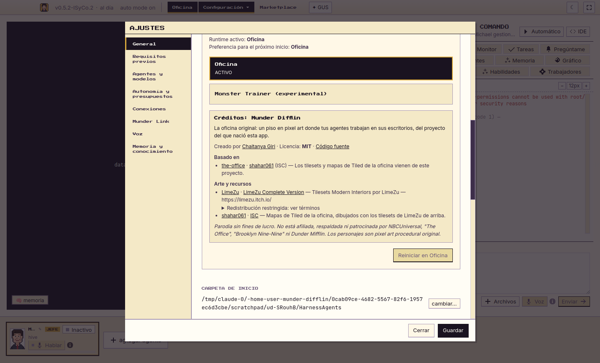
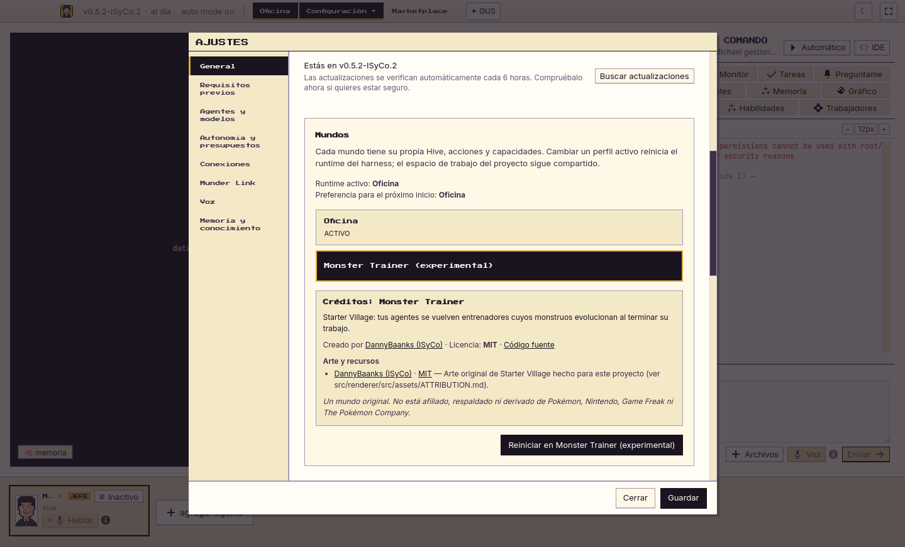

# Manifiesto de mundos: quién lo hizo, con qué licencia, de dónde viene

Cada mundo de ISyCo Worlds trae un manifiesto, tanto los que vienen con la app
como los que llegue a traer el Marketplace. Ahí queda escrito quién lo creó,
bajo qué licencia, dónde está su código, de qué otra obra se deriva y de quién
es cada archivo de arte que trae.

Si falta algo, el CI falla. La procedencia no depende de que alguien se acuerde
de ponerla.

En la app, los créditos del mundo elegido aparecen en **Configuración → General
→ Mundos**:

| Munder Difflin | Monster Trainer |
|---|---|
|  |  |

## Dónde viven

- `src/shared/worldManifests/<id>.world.json`: un archivo por mundo.
- `src/shared/worldManifest.ts`: el formato y el validador. Es código puro,
  así que la app y las pruebas aplican las mismas reglas.
- `src/shared/worldManifests.ts`: une cada id de mundo con su manifiesto. Si un
  mundo nuevo no tiene manifiesto, la app no compila.
- `test/world-manifest.test.cjs`: lo que el CI exige.

## Los campos

```jsonc
{
  "manifestVersion": 1,
  "id": "mi-mundo",                       // kebab-case
  "name": "Mi Mundo",
  "description": { "en": "…", "es": "…" }, // inglés obligatorio, los demás idiomas opcionales
  "author": { "name": "Quien lo hizo", "url": "https://…" },
  "license": "MIT",                        // licencia del código del mundo (SPDX)
  "source": "https://github.com/…",        // dónde está el código; solo https
  "derivedFrom": [                         // opcional: de qué otra obra viene
    { "name": "…", "author": { "name": "…" }, "license": "…", "source": "https://…", "note": "…" }
  ],
  "assets": [                              // cada archivo de arte que trae
    {
      "path": "src/renderer/src/assets/worlds/mi-mundo/",
      "author": { "name": "…", "url": "https://…" },
      "license": "CC0-1.0",
      "source": "https://…",
      "redistribution": "open",            // "open" o "restricted"
      "terms": "…",                        // obligatorio si es "restricted"
      "credit": "…"                        // la línea de crédito que exija la licencia
    }
  ],
  "disclaimers": ["…"]                     // avisos de marca o de no afiliación
}
```

Los textos (`description`, `note`, `terms`, `credit`, `disclaimers`) pueden ser
una cadena o un objeto por idioma con `en` obligatorio. La app muestra el
idioma de quien la usa y, si no está, inglés.

## Lo que exige el CI

- Cada mundo de `WORLD_IDS` tiene manifiesto, y su `id` coincide.
- `name`, `description`, `author.name`, `license` y `source` (https) no pueden
  faltar.
- Cada `derivedFrom` trae nombre, autor, licencia y fuente: si un mundo se
  deriva de otro, el crédito a la obra original es obligatorio.
- Cada asset declara autor, licencia y `redistribution`. Si es `restricted`,
  `terms` dice qué está restringido.
- Cada ruta declarada existe. **Todo archivo dentro de las carpetas de arte de
  mundos** (`assets/tilesets/`, `assets/maps/`, `assets/worlds/`) tiene que
  estar cubierto por un asset de algún manifiesto. Si alguien agrega arte sin
  crédito, el CI falla.
- Ningún archivo queda reclamado por dos mundos a la vez.

## Cómo quedaron los dos mundos de hoy

- **Munder Difflin** (`office`):
  - Mundo original de Chaitanya Giri, con licencia MIT.
  - Se deriva de `shahar061/the-office` (ISC), de donde vienen los tilesets y
    los mapas.
  - Los tilesets son de LimeZu y están marcados como `restricted`.
  - Lleva un aviso de parodia sin fines de lucro y de no afiliación con
    NBCUniversal.
- **Monster Trainer**:
  - Mundo original de DannyBaanks (ISyCo), con licencia MIT.
  - El arte de Starter Village es original. El detalle está en
    `src/renderer/src/assets/ATTRIBUTION.md`.
  - Lleva un aviso de no afiliación con Pokémon, Nintendo, Game Freak y The
    Pokémon Company.

Sobre LimeZu: `LIMEZUASSETS-LICENSE.txt` dice "YOU CAN'T RESELL OR DISTRIBUTE
THE ASSET TO OTHERS", y la licencia se compró para el proyecto original. El
manifiesto lo deja visible para que el dueño del repo decida si tener esos PNG
en un repo público está cubierto. No pretende resolverlo.
